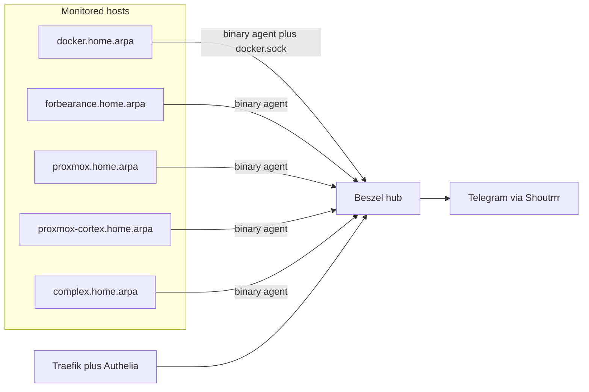

# Migrate CheckMK to Beszel

Working implementation tracking: [implementation_ledger.md](./implementation_ledger.md).

## Goal

Replace the CheckMK Ultimate site (`/opt/docker/checkmk`, ~1.5–3 GiB) with Beszel (hub + agents) for host metrics, Docker container stats, and Telegram alerts on a small homelab (~3 hosts, ~20 containers).

## Why Beszel

CheckMK does an adequate job monitoring hosts and Docker, but:

- Operational quirks generate noise (unstable host labels, SSL certificate alerts).
- Resource use is disproportionate (~2–3 GiB RAM for a handful of hosts).

Beszel provides host + per-container Docker metrics, history, and alerts with a much smaller footprint (hub tens of MB; agent ~10 MB).

## Current CheckMK baseline (source of truth for cutover)

| Item | Detail |
|------|--------|
| Project | `/opt/docker/checkmk` |
| Image | `checkmk/check-mk-ultimate:2.5.0p10`, site `cmk` |
| Memory | `limits-xxlarge` → 3 GiB cap; observed ~1.5 GiB |
| Hosts | `docker.home.arpa`, `forbearance.home.arpa`, `proxmox.home.arpa` (agents); `router` (VyOS SNMP) |
| Containers | ~22 piggyback hosts via DCD + `checkmk_monitor=true` labels |
| Alerts | Telegram notification script |
| Front door | Traefik `checkmk.${DOCKER_DOMAIN}` + Authelia; agent receiver host `:8000` |
| Deploy | Puppet `git_deploy_projects.checkmk` + systemd path unit |

## Architecture (target)

## Target layout

- **New project:** `/opt/docker/beszel` (do not repurpose the checkmk git remote).
- Mirror peer stack conventions (`checkmk`, `grafana-loki`):
  - Use `compose-security-baseline` hardened profiles (`hardened-small` for hub).
  - Traefik: `beszel.${DOCKER_DOMAIN}`, HTTPS, Authelia + `secured@file`.
  - External network `traefik_proxy`.
  - Pin image tags (not `:latest`) once a known-good release is chosen.
- **Hub only in Compose** on `docker.home.arpa` (no compose agent or socket-proxy).
- **Binary agents on all Debian hosts** (`docker`, `forbearance`, `proxmox`,
  `proxmox-cortex`, `complex`) via Hiera `os/Debian.yaml` — same model as CheckMK:
  host-installed agent + systemd, not a privileged container. Agent runs as
  FreeIPA user `beszel` (`nologin`, via `freeipa_users` on docker; SSSD on all
  hosts). Not root, not `user_l`, and not `get.beszel.dev` (that would create a
  conflicting local user).
- **Uniform agent→hub path:** every host (including `docker.home.arpa`) uses
  `HUB_URL=https://beszel-agent.${DOCKER_DOMAIN}`. No special-case loopback publish.
- **Front door split:**
  - UI: `https://beszel.${DOCKER_DOMAIN}` — Authelia + `secured@file` (LAN allowlist)
  - Agents: `https://beszel-agent.${DOCKER_DOMAIN}` — **no Authelia**; Traefik routes
    only `PathPrefix(/api/beszel/agent-connect)`; still behind `secured@file` (LAN
    allowlist). App-level auth is Beszel KEY/TOKEN + mutual handshake/fingerprint.
- **Docker container stats** on `docker.home.arpa`: bare-metal agent uses the host
  Docker socket directly (`unix:///var/run/docker.sock`). FreeIPA `beszel` is in the
  local `docker` group on that host only. A compose socket-proxy is for container
  consumers (Traefik); it is unnecessary for a host agent.
- **Auth:** Authelia OIDC SSO (same pattern as Grafana; FreeIPA users). Traefik
  UI = `secured@file` only. Agents: KEY/TOKEN on `beszel-agent` hostname.
- **Alerts:** Shoutrrr Telegram URL in Beszel settings (reuse existing bot/chat where possible).
- **Puppet:** `profile::beszel_agent` installs the pinned binary and
  `beszel-agent.service` (User=`beszel`); KEY/TOKEN in Vault. Later add
  `beszel: {}` under `git_deploy_projects` for hub compose deploy (same pattern as
  checkmk).

## Phases

### Phase 0 — Project docs (bootstrap — complete)

1. Create `/opt/docker/beszel/`.
2. Write this `plan.md`.
3. Write `implementation_ledger.md` seeded with tasks.
4. **Stop here for bootstrap.** Scaffold + these markdown files only. Phase 1+ is driven by the ledger (currently next: **P1-06**).

### Phase 1 — Stand up Beszel (parallel with CheckMK)

1. Hub compose + Traefik route; admin user.
2. FreeIPA `beszel` user + `profile::beszel_agent` on `docker`, `forbearance`,
   `proxmox`; confirm green systems + containers on docker host (agent uses host
   `docker.sock` as `beszel` in the `docker` group).
3. Telegram + conservative alerts; parallel-run vs CheckMK.

### Phase 2 — Cut over

1. Beszel as primary alert path; mute CheckMK Telegram.
2. Stop day-to-day use of CheckMK UI.

### Phase 3 — Decommission CheckMK

1. Stop checkmk stack and deploy units.
2. Swap Puppet git-deploy (`checkmk` → `beszel`).
3. Remove Traefik `checkmk:` entrypoint `:8000`.
4. Optional `checkmk_monitor` / `checkmk_agent` label cleanup; uninstall CheckMK agents; Vault/Authelia cleanup; archive volume/repo.

## Router (VyOS)

**v1:** Drop CheckMK SNMP. When the router is fully down, in-LAN Telegram alerts cannot leave anyway.

**Optional later:** Beszel agent via VyOS Podman (`allow-host-networks`, state under `/config`) for “router is sick but up” host metrics. Does not replace SNMP-class routing views and does not fix total-outage notification path. True dead-router visibility needs an **external** uptime probe.

## Explicit non-goals (v1)

- No SNMP and no VyOS Beszel agent in the initial cutover.
- No SSL certificate service checks.
- No CheckMK → Beszel history/config import.
- No CheckMK Ultimate license or agent bakery.
- No compose agent sidecar and no Beszel-owned Docker socket-proxy (host agent uses the real socket; Traefik’s proxy stays Traefik-only).
- No `get.beszel.dev` / local `beszel` system user — FreeIPA owns the identity.

## Risks

- The docker-host binary agent uses the host Docker socket via the `docker` group
  (same privilege class as other host docker clients; not root). Traefik’s
  socket-proxy remains for container consumers only.
- Agents need a reachable `HUB_URL`. UI hostname stays behind Authelia; agents use
  dedicated `beszel-agent.${DOCKER_DOMAIN}` (path-limited, LAN allowlist, Beszel
  token/key auth). Exposing agent-connect without Authelia means a stolen universal
  token can enroll agents from the LAN — protect the token like a credential.
- No metric history migration from CheckMK RRDs.

## Success criteria

- `plan.md` and `implementation_ledger.md` exist and stay current.
- Hub + 3 systems green; Docker containers visible under the docker host.
- Telegram alerts for host down / resource thresholds work.
- CheckMK stopped; ~1.5–3 GiB RAM reclaimed.
- No dependency on CheckMK labels, port 8000, or bakery agents.
