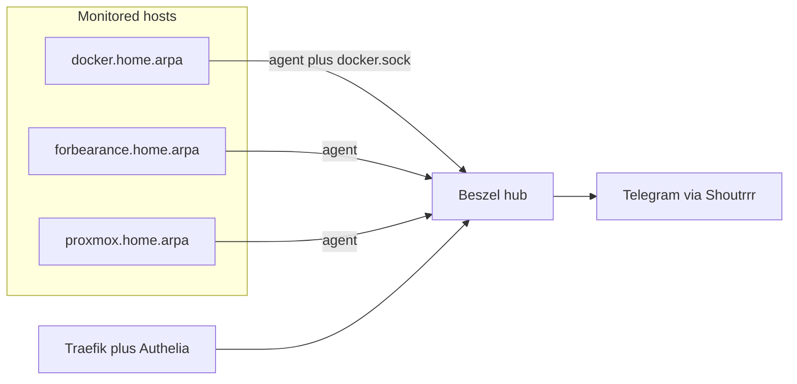

# Migrate CheckMK to Beszel

Working implementation tracking: [implementation_ledger.md](./implementation_ledger.md).

## Goal

Replace the CheckMK Ultimate site (`/opt/docker/checkmk`, ~1.5–3 GiB) with Beszel (hub + agents) for host metrics, Docker container stats, and Telegram alerts on a small homelab (~3 hosts, ~20 containers).

## Why Beszel

CheckMK does an adequate job monitoring hosts and Docker, but:

- Operational quirks generate noise (unstable host labels, SSL certificate alerts).
- Resource use is disproportionate (~2–3 GiB RAM for a handful of hosts).

Beszel provides host + per-container Docker metrics, history, and alerts with a much smaller footprint (hub tens of MB; agent ~10 MB).

## Current CheckMK baseline (source of truth for cutover)

| Item | Detail |
|------|--------|
| Project | `/opt/docker/checkmk` |
| Image | `checkmk/check-mk-ultimate:2.5.0p10`, site `cmk` |
| Memory | `limits-xxlarge` → 3 GiB cap; observed ~1.5 GiB |
| Hosts | `docker.home.arpa`, `forbearance.home.arpa`, `proxmox.home.arpa` (agents); `router` (VyOS SNMP) |
| Containers | ~22 piggyback hosts via DCD + `checkmk_monitor=true` labels |
| Alerts | Telegram notification script |
| Front door | Traefik `checkmk.${DOCKER_DOMAIN}` + Authelia; agent receiver host `:8000` |
| Deploy | Puppet `git_deploy_projects.checkmk` + systemd path unit |

## Architecture (target)

## Target layout

- **New project:** `/opt/docker/beszel` (do not repurpose the checkmk git remote).
- Mirror peer stack conventions (`checkmk`, `grafana-loki`):
  - Extend `compose-security-baseline` with a small/medium hardened profile.
  - Traefik: `beszel.${DOCKER_DOMAIN}`, HTTPS, Authelia + `secured@file`.
  - External network `traefik_proxy`.
  - Pin image tags (not `:latest`) once a known-good release is chosen.
- **Hub + local agent** on `docker.home.arpa`: unix socket between hub and agent; agent mounts `/var/run/docker.sock:ro`.
- **Remote agents** on `forbearance` and `proxmox`: binary or Docker agent; `HUB_URL=https://beszel.${DOCKER_DOMAIN}`, hub `KEY`, registration `TOKEN`.
- **Auth:** local admin first; optional Authelia OIDC later (Grafana already uses Authelia OIDC).
- **Alerts:** Shoutrrr Telegram URL in Beszel settings (reuse existing bot/chat where possible).
- **Puppet:** add `beszel: {}` under `profile::docker_host::git_deploy_projects` in `puppet-control-repo/data/nodes/docker.yaml`; matching systemd deploy units (same pattern as checkmk).

## Phases

### Phase 0 — Project docs (bootstrap — complete)

1. Create `/opt/docker/beszel/`.
2. Write this `plan.md`.
3. Write `implementation_ledger.md` seeded with tasks.
4. **Stop here.** Bootstrap scope is only the directory scaffold and these markdown files. All Phase 1+ implementation is resumed **from inside `/opt/docker/beszel`**, driven by the ledger (next: P1-01).

### Phase 1 — Stand up Beszel (parallel with CheckMK)

1. Hub (+ local agent) compose, Traefik route, data volume, README.
2. Admin user; register `docker.home.arpa`; confirm host + container metrics.
3. Agents on `forbearance` and `proxmox`; confirm green systems.
4. Telegram + conservative alerts; parallel-run vs CheckMK.

### Phase 2 — Cut over

1. Beszel as primary alert path; mute CheckMK Telegram.
2. Stop day-to-day use of CheckMK UI.

### Phase 3 — Decommission CheckMK

1. Stop checkmk stack and deploy units.
2. Swap Puppet git-deploy (`checkmk` → `beszel`).
3. Remove Traefik `checkmk:` entrypoint `:8000`.
4. Optional `checkmk_monitor` / `checkmk_agent` label cleanup; uninstall CheckMK agents; Vault/Authelia cleanup; archive volume/repo.

## Router (VyOS)

**v1:** Drop CheckMK SNMP. When the router is fully down, in-LAN Telegram alerts cannot leave anyway.

**Optional later:** Beszel agent via VyOS Podman (`allow-host-networks`, state under `/config`) for “router is sick but up” host metrics. Does not replace SNMP-class routing views and does not fix total-outage notification path. True dead-router visibility needs an **external** uptime probe.

## Explicit non-goals (v1)

- No SNMP and no VyOS Beszel agent in the initial cutover.
- No SSL certificate service checks.
- No CheckMK → Beszel history/config import.
- No CheckMK Ultimate license or agent bakery.

## Risks

- Docker socket on the agent is a privilege boundary (read-only mount ≠ safe Docker API); acceptable for this homelab docker host.
- Agents need a reachable `HUB_URL`. Authelia on the same hostname may require a split agent path (like CheckMK’s API router) or an internal URL — record the tested outcome in the ledger.
- No metric history migration from CheckMK RRDs.

## Success criteria

- `plan.md` and `implementation_ledger.md` exist and stay current.
- Hub + 3 systems green; Docker containers visible under the docker host.
- Telegram alerts for host down / resource thresholds work.
- CheckMK stopped; ~1.5–3 GiB RAM reclaimed.
- No dependency on CheckMK labels, port 8000, or bakery agents.
